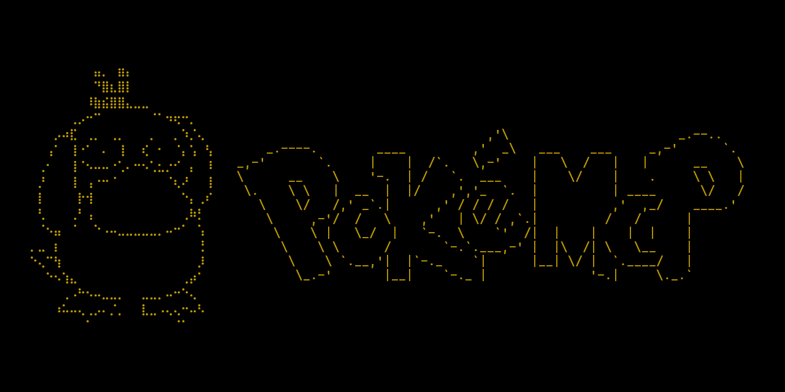
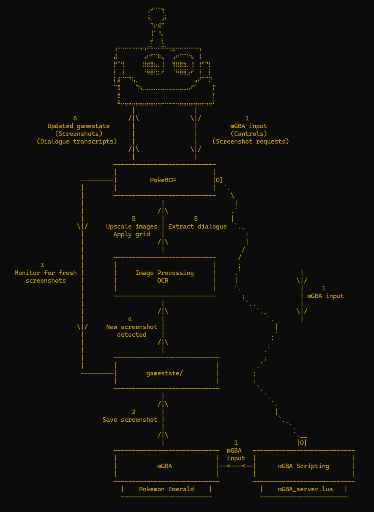
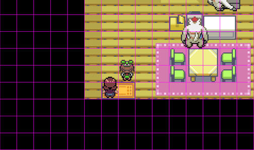
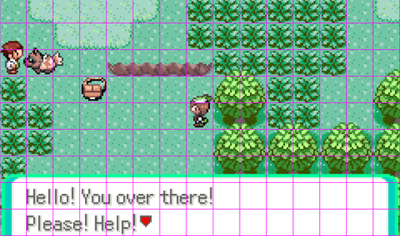
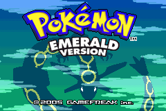

# PokeMCP


Providing vision-enabled models with a regular Pokemon GBA experience. No memory access or full area maps, just a rulebook, controller and intermittent screenshots.

\*By default, game screenshots are overlaid with a high contrast grid where one square represents one game tile to minimize needless corrective `walk` tool calls.

# Agentic Flow




> "*I can see the following: ... * A white-haired NPC (possibly DAD) in the upper right.*" - Qwen3.8-27B


> (Referencing Zigzagoon) "*The creature looks like a brownish fish-like Pokémon — could it be a Magikarp? No, Magikarp is red/orange. This looks brownish/tan with a tail. Could it be a wild Pokémon that's been knocked out? Or is it a "Lunatone"? Hmm. Could it be a wild "Carvanha"? Carvanha is blue. Looks like a brown/tan Pokémon, maybe a Rufflet? No, in Emerald... let me think. A brown bird-like Pokémon with a cream-colored chest. Could be a Rufflet? No, Rufflet is from Gen 5. In Emerald, a brown bird Pokémon... could be a Spearow? No, Spearow is smaller. Could be a Rufflet... no. Let me think: brown with a cream/white chest, looks like a bird. Could be a "Rufflet"? Not in Emerald. Could be a "Starly"? Starly is from Gen 4. Hmm.*" - Qwen3.8-27B

Any model with agentic and visual capabilities can play, each to varying degrees of success. 

Model temperature controls how much the model deviates from its highest-probability next tokens. 
Higher temperatures result in further deviation from the "best" choice: a more exploratory, creative approach in a task-solving context.
Lower temperatures are the opposite, they are less likely to deviate from what is understood as the "best" next token candidate.
When a model doesn't understand the game mechanics or how it should behave in order to make consistent progress, creativity is chaos. 
You cannot formulate novel solutions to a problem that is not fully understood because you don't know what success looks like or how to approach achieving it.
Running models at lower temperature values (~0.1) paired with a general explanation of the game helps weaker models make better decisions relative to game progression.
This may not be true in stronger models that do understand how to progress, understand the game context, what NPCs are important and how to complete near-term game objectives.

The flaws in the visual-only approach are the selling points. Misidentifications are funny, and achieving milestones in spite of them makes for a very entertaining playthrough.
Mistakes hindering progression are often indicative of a misunderstanding of some aspect of the game. 
Addressing and explaining these issues as they appear in `resources/guide.md` strengthens the foundation and enables deeper progression as these misunderstandings become rarer.

For instance, early in the game, "MOM" suggests the player needs to set the clock in their bedroom. In a vacuum, this is an unimportant task and the model identifies it as such.
In the context of the game, this misidentification is fatal. The player is not allowed to leave without setting the clock, but the model can repeatedly attempt to and get stuck.
`resources/guide.md` offers an explanation: these light suggestions are not what they seem, they are hard-gate orders that will block progression and need to be pursued immediately.

Sometimes, something revealing important game context gets lost in between screenshot intervals. Intervention is sometimes necessary to fill the gap of what was missed.

The spirit of the project is as close to a blind, regular playthrough as possible: `resources/guide.md` serves as a metaphorical "guide to fishing" rather than providing the fish.

# Components

* `mGBA_server.lua` - The mGBA server script built with the excellent [mGBA scripting API](https://mgba.io/docs/scripting.html).
    * Opens a TCP socket, listens for client commands and inputs them into the emulator.
    * Extremely simple protocol for client messages: `<KEY>[,<KEY>...] <FRAMES>|`
        * `A 10|` - Client message to hold "A" for 10 frames.
        * `A,B,START,SELECT 1|` - Client message to simultaenously hold "A", "B", "START" and "SELECT" for 1 frame.
        * `SCREENSHOT 1|` - Client message to request a new game screenshot.

* `pokemcp/` - The MCP server.
    * Connects to the `mGBA_server.lua` socket and bridges the gap between model and emulator.
    * Exposes a range of game-related tools to the connected model.

# Tools

* `process_dialogue` - Automatically cycles through dialogue and uses OCR to provide the model with a full transcript.
    * Efficiency tool, saves time and model context from ingesting ~5 unnecessary screenshots at the cost of some accuracy (model reads better than OCR). 
    OCR errors are often minor and models shouldn't have an issue correcting mistakes in the transcript.

* `screenshot` - Request a fresh game screenshot from the emulator.
    * Useful for when the previous screenshot was taken mid screen transition and the model needs to see if the game is "ready" yet.

* `walk` - Abstracted subset of the `raw_input` tool. Enables the model to queue up a sequence of "walk X direction for Y tiles" commands.
    * Takes the guess work out of "how many frames do I need to hold a directional button until my character moves where I want them to".

* `raw_input` - Exposes the entire GBA controller to the model (A, B, RIGHT, LEFT, UP, DOWN, START, SELECT, R, L).
    * Useful for navigating menus.

* `read_journal` - Allows the model to read the content inside its session journal.

* `write_journal` - Allows the model to overwrite its session journal with up-to-date information.

# Sessions

The visual-only approach is taxing on the model context window, it is unlikely that the game will be completed within a single context window.

The solution is integrating a form of persistent memory on disk.

By having a model keep a journal of their game history, objectives and important relevant information, a single playthrough can survive inevitable context window wipes.

When an agent's context window becomes exhausted, bring in a new one that can read the journal of its predecessor and understand how to push forward.

Each MCP session stores a journal and related game save to enable multiple different playthroughs to happen together without overwriting each other.

# Requirements

* Lua
* [mGBA](https://mgba.io/downloads.html)
* [Tesseract](https://github.com/tesseract-ocr/tesseract) 
    * *Note: Pytesseract requires that the `tesseract` binary is accessible in your PATH environment variable.*

# Usage

Ensure your Pokemon Emerald ROM is in `games/`, mGBA keeps save files in the same directory as the running game. 
Saves generated in this folder are automatically copied to the active session folder during gameplay.

Set your preferred host and port for `mGBA_server.lua` to listen on at the top of `mGBA_server.lua`.

Start the MCP server:
```
uv run pokemcp --session-name test-session --mcp-host 127.0.0.1 --mcp-port 6001 --mgba-host 127.0.0.1 --mgba-port 1337
```

Launch mGBA, navigate to `Tools` -> `Scripting...` to open the Scripting window. In the Scripting window, navigate to `File` -> `Load script...` and load `mGBA_server.lua`.

On the main mGBA window, navigate to `File` -> `Load ROM...` and load Pokemon Emerald from the `games/` folder.

Connect your model to the MCP server, ensure its tools are available and give your model the prompt in `resources/guide.md` when the main menu splash screen is showing to begin.



# Disclaimer

This is an unofficial, fan-made project created for educational and entertainment purposes. 
Pokémon, Pokémon Emerald, and all related characters, names, and assets are trademarks of 
Nintendo, Game Freak, and Creatures Inc.

This project is not affiliated with, endorsed by, or sponsored by any of these companies.

This repository does not include or distribute any game ROMs. Users must provide their own 
copy of Pokémon Emerald.
